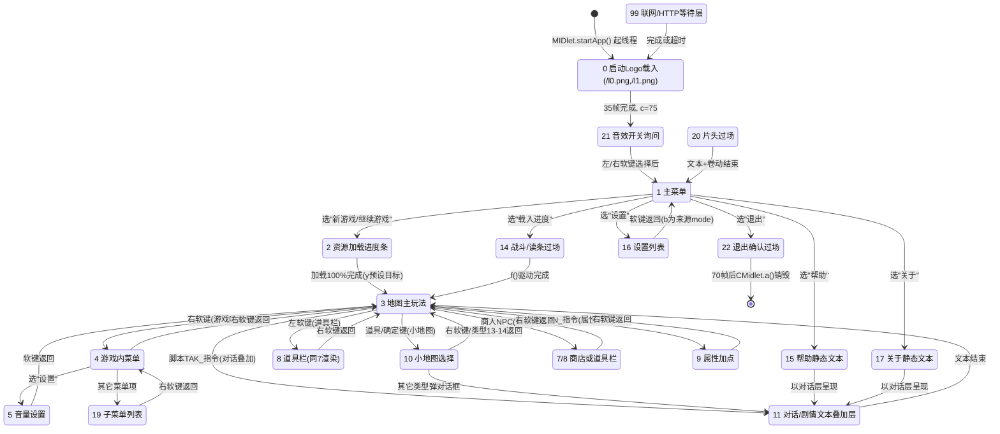

# 状态机、主循环与 I/O 面考证

**结论先行**：游戏是单类 `a extends Canvas implements Runnable` 的经典 MIDP-1.0 "一个线程 + 一个大 switch"
结构。核心状态字段是 `private byte a`（声明于 `reference/seed/a.java:57`，以下记作 **`mode`**），
在 `run()`（主循环，`a.java:1359`）与 `paint(Graphics)`（渲染，`a.java:630`）中各有一个
`switch (this.a)`，两者的 case 值集合高度重合，分别承担"每帧逻辑 tick"与"按模式画面"。
帧节奏是 **固定帧长 busy-wait**（载入期 100ms/帧，正式进入游戏后 75ms/帧，约 13.3 fps），
无 `getGameAction`，按键码直接作为原始 MIDP/Nokia 键值使用。联网/计费子系统（HTTP 登录）
通过复用同一个 `Runnable.run()` 实例作为一次性工作线程实现，与主循环互斥（`this.F` 标志位）。

**考证方法**：对 `reference/seed/a.java`（CFR 反编译，8457 行）做静态阅读 + grep 全量定位
（字段声明、赋值点、`switch` case 枚举、方法调用关系），交叉对照
`docs/findings/jar-forensics.md` 已证实的 API 清单与资源格式结论；按 AGENTS.md §3 分级证据，
C 级结论全部收入"假设"节。本文档只允许由任务方写入 `docs/findings/state-machine.md` 本文件。

---

## 已证实

### 1. 核心状态字段

- **结论**：游玩期的"当前模式"是 `private byte a`（第 5 个同名字段，字段表第 57 行），
  被 `run()` 的 `switch (var5_3.a)`（`var5_3` 即 `this` 的局部别名）与 `paint()` 的
  `switch (this.a)` 共同消费。
  Evidence: `reference/seed/a.java:57`（声明）、`reference/seed/a.java:1526`
  （`switch (var5_3.a)` 起始）、`reference/seed/a.java:638`（`switch (this.a)` 起始）。
- **结论**：模式切换的"进入动作"统一走单一分发方法 `private void a()`（无参，位于
  `reference/seed/a.java:2437`），其内部也是 `switch (this.a)`，在设置新 mode 值之后立即调用，
  用于一次性初始化该模式的子状态（如清空列表索引、读取存档、重置动画计时器）。
  Evidence: `reference/seed/a.java:2437-2672`（方法体，switch case 1/3/4/5/7/8/9/10/12/13/14/15/
  16/17/19/20/21/22）。
- **结论**：`run()` 内还有一个独立的 **输入锁定/特殊输入模式** 字段 `private int i`
  （字段表第 76 行，整个代码库中唯一的 `int` 类型 `i`），通过 `switch (var5_3.i)` 在主状态
  switch **之前**被检查；若该分支把输入吃掉（调用 `super.g()` 清空待处理键），本帧状态 switch
  的输入消费部分（`var5_3.f`/`var5_3.g` 清零）会被跳过执行，但状态 switch 本体仍然执行。
  Evidence: `reference/seed/a.java:76`（声明）、`reference/seed/a.java:1382`
  （`switch (var5_3.i)` 起始，case 0/1/2/3/4/5）。
  **重要附带发现**：全文件 grep 未发现任何对 `this.i`（int 版本）的显式赋值语句
  （无 `this.i = <int>`、无自增/自减），说明该字段永远保持 Java 默认值 `0`，
  `switch(var5_3.i)` 实际永远落入 `case 0` 分支（见"遗留问题清单"与下方假设节的死代码推测）。
  Evidence: 全文件 grep `\.i = ` 仅命中非 int 类型的 `i` 字段赋值（`String[]`/`short[]`/`boolean[]`），
  grep `\.i\+\+|\+\+.*\.i\b` 零命中。

### 2. 模式表（覆盖 `paint()`/`run()` switch 全部 case 值）

两处 switch 的 case 值集合：
- `paint()`：0,1,2,3,4,5,7,8,9,10,11,12,13,14,15,16,17,18,19,20,21,22,99（`a.java:640-1358` 内枚举）
- `run()`：0,1,2,3,4,5,7,8,9,10,11,12,13,14,15,16,17,19,20,21,22,99（`a.java:1382-2432` 内枚举，
  `case 15: case 17: { break; }` 为合并空分支，见 `a.java:2326-2328`；**缺 18**）

`paint()` 独有 **18**（run() 无对应 case，纯渲染态，详见下表备注）；`run()` 的 case 4 分组同时覆盖
paint() 的 `case 4: case 19:`（两个 paint 分支共享一套渐变/列表绘制代码，但 run() 对 4 与 19
分别有独立的按键处理块）；mode 15/17 在 `run()` 中是**合并的空操作分支**
（而非完全缺失），说明帮助/关于两个静态文本页确实"注册"在主状态机里但不需要任何逐帧逻辑。

| mode | 含义（证据分级） | 进入条件 / 来源 | 退出 / 下一状态 | paint 分支行号 | run 分支行号 |
|---|---|---|---|---|---|
| 0 | **启动画面/Logo 载入**（A）：读 `/l{n}.png`，连续失败则跳过，成功显示 35 帧后进入主菜单音乐载入 | 字段默认值（`this.a` 未显式初始化为别值即隐含 0，构造器未设） | 35 帧后 `this.c=75; this.a=(byte)21` | `a.java:640` | `a.java:1500-1532` |
| 21 | **音效开关询问弹窗**（A）：`drawString("是否开启声音？")` | mode 0 结束后进入 | 左软键(-6)→开启声音(`this.D=true`)；右软键(-7)→关闭(`this.D=false`)；两者都转 `mode=1` | `a.java:756` | `a.java:1534-1552` |
| 1 | **主菜单**（A）：显示标题图 + 菜单文字列表（新游戏/继续游戏/载入进度/保存游戏/设置/帮助/关于/退出…，`this.c` 字符串数组见 `a.java:466`） | mode 21 之后，或从游戏内通过右软键"返回菜单"回退 | 方向键选菜单项，确定键(-5/53)按 `var7_11.a[var7_11.k]`（菜单项索引→动作表）分派到 14(载入进度)/8/16/15/17/22(退出) | `a.java:651` | `a.java:1553-1622` |
| 2 | **进度条载入画面**（A）：`super.a(8)/a(10)/a(2)/a(1)/a(3)…`按 `var6_5.P[var6_5.bP]` 顺序逐步加载各资源分组（图片组 1/2/3/4/6/7/12/13 等）并推进进度条 `bN/bQ` | 由主菜单"新游戏"或存档读入触发 | 加载完 100% 后 `var6_5.a = var6_5.y`（跳到由调用方预设的下一个 mode，典型为 3=地图） | `a.java:671` | `a.java:1623-1696` |
| 3 | **地图/关卡主玩法**（A）：地图卷动渲染 + 教程文字框（`this.l` 子状态 0=普通/1=移动动画/2=探索确认/3=教程翻页/5=…） | mode 2 加载完成后；或存档读取后；或道具栏/战斗/商店返回 | 左软键(-6)→打开道具栏(`mode=10`)；右软键(-7)→暂存并打开游戏内菜单(`mode=4`) | `a.java:765` | `a.java:1698-1790` |
| 4 | **游戏内菜单（继续/保存/设置/退出）**（A）：从 mode3 右软键进入，列表式菜单，复用与 paint case 19 相同的居中圆角面板绘制代码 | mode3 右软键 | 右软键(-7)返回 `this.a = this.c`（恢复进入前的 mode，典型回到 3） | `a.java:801`（与 case 19 共享渲染代码块） | `a.java:1954-1972` |
| 5 | **音量/设置子菜单**（A）：`this.a(false)` + 垂直滑动条绘制（`bd/be/bf/bg`） | mode4 中选择"设置" | 左右软键(-6/-7)返回 `mode=3` | `a.java:870` | `a.java:1974-1990` |
| 7 | 【2026-10-09 更正（t3 考证 `aec13a1`）】**存档位保存界面**：确认键执行 `r(am)+q(槽号)` 全量存档并弹"保存成功！"（`a.java:1992-2065`）——该提示为**正常反馈非 bug**。~~原判读：商店购买/交易界面（横向货架 6 格滑动 `bC/bD/bE/bG`）~~（原主张保留存史，"疑似 bug 线索"随 §9 线索 1 一并销案） | 原判读"商人 NPC 触发"存疑待复核 | 左软键(-6)=确认保存→"保存成功！"；右软键(-7)返回 `this.a = var6_5.b` | `a.java:954` | `a.java:1992-2065` |
| 8 | **道具/装备栏界面**（A，与 7 共用渲染和按键代码）：`this.n/this.o`在 `private void a()` 分发表 case 7/8 中被统一初始化 | mode3 左软键，或商店/装备流程 | 同上，左软键在 `mode==8` 分支判断 `var6_5.h[var6_5.bE]`（物品是否可用）后进入使用结算 | `a.java:960` | 同 case 7（合并 case） |
| 9 | **仙丹/属性加点结算界面**（A）：`aC` 选择 ATK/DEF/HP 三选一，花费 `ay` 金钱 | 剧情脚本 `GIN_` 指令或道具使用触发 | 左软键(-6/-5)若金钱足够扣款并加属性，`ar`（加点次数）自增、`ay` 按 `a.b(ar+1)` 公式增长；右软键(-7)返回 `mode=3` | `a.java:966` | `a.java:2067-2103` |
| 10 | **大地图/楼层缩略图选择界面**（A）：3×N 网格图标，支持方向键翻页（`aT`每行格数，`aU/aV`可见范围，`aX`总行数） | mode3 左软键打开道具栏后再选"小地图"类道具，或确定键探索触发（见 mode3 case 1→确定 53/-5 的隐藏入口） | 确定键(-5/53)按选中格 `r[ba]` 的类型值进一步跳转（13/14→`mode=3`+ `super.c(h)`；15/23/24/25→对话框 `(byte)3` 窗口；默认→对话框 `(byte)1,(byte)2` 窗口）；右软键(-7)返回 `mode=3` | `a.java:996` | `a.java:2105-2142` |
| 11 | **对话/剧情文本框叠加层**（A）：`this.q` 子状态 0=等待显示下一句/1&6=打字机效果/2=（见 `super.y()`，可能是选项分支）/3=镜头平移/4=等待动画完成/5=清理；复用 `h/I` 等文本排版字段 | 任意 mode 中由脚本 `TAK_a_b`（对话文本区间）指令触发（叠加显示，不单纯替换当前 mode） | `super.a()`完成镜头/动画后 `q=0`；文本放完若 `f==0` 且到达末句，软键继续或结束叠加层 | `a.java:680`（与 mode3 共享 `a(true)/h(0,20)` 背景逻辑） | `a.java:2144-2267` |
| 12 | **（证据不足，B 级）疑似"场景过渡/黑屏淡入淡出"**：仅 `super.o()`（滚动/翻页通用例程），无专属字段操作 | `private void a()` case 12：`a6.i(0); this.o=(byte)3` | 未见显式退出赋值，推测由外部脚本指令或动画计数驱动回到地图 mode | `a.java:1127`（见下方代码片段上下文，紧邻 case 9 之后，具体行号在 `super.a(this.e...)`附近） | `a.java:2269-2271`（仅 `super.o(); break;`） |
| 13 | **空分支（run 中 `case 13: { break; }`，paint 中为血条/货币显示叠层）**（A）：`private void a()` case 13 同样为空（`return;`） | 不明（无状态转入点被发现，疑似仅作占位或由其他路径短暂借用） | 无显式退出逻辑 | `a.java:1059` | `a.java:2273`（空实现） |
| 14 | **战斗/读条动画过场**（A）：`private void a()` case 14 重置 `t/u/v/b/d` 等战斗序列字段；`private void f()` 驱动逐步播放"胜利/战败"插画 + 文本（`a.java:2944` 起） | mode1 主菜单"载入进度"项，或战斗结束流程 | `super.f()`（`a.java:2941`）驱动完成后 `this.u()`（未在样本中展开，推测回到地图） | `a.java:1063` | `a.java:2275-2279` |
| 15 | **帮助/操作说明静态文本页**（A，**verbatim 游戏内文本证实完整操作说明，见输入映射节**） | >【2026-10-10 更正（BUG-007）】主菜单"帮助"项(光标5)实际进 mode 22 退出；mode 15 的实际入口是主菜单**"保存游戏"项(光标3)**——文字-动作错位，见 docs/findings/runtime-semantics.md §2 | 任意键 `this.a((byte)0, text,0,0)` 弹出式对话层后由对话层(`mode 11`)流程结束返回 | `a.java:1142` | `a.java:2326-2328`（与 17 合并的空分支，逐帧逻辑完全由对话层 mode11 承担） |
| 16 | **设置列表（音效/小地图开关等）**（A）：`this.aF` 项数，`this.l[n]` 项类型（0=声音开关 触发 `D`、1=小地图开关） | >【2026-10-10 更正（BUG-007）】主菜单"设置"项(光标4)实际进 mode 17；mode 16 的主菜单入口是**"载入进度"项(光标2)**（错位；且该路径无载入队列，见 runtime-semantics §6）。游戏内菜单(mode4)的"设置"项经 m_012 case4 正常入 16 | 方向键切换项，确定/软键(-3/-4/-5)切换 `f[aE]` 布尔值；左/右软键(-6/-7)返回 `this.a = this.b`（来源 mode） | `a.java:1154` | `a.java:2369-2404` |
| 17 | **关于/版权信息静态文本页**（A，verbatim 显示开发组名单与客服电话；2026-10-10 trace FL062 tick1361 "版权所有："实证） | >【2026-10-10 更正（BUG-007）】主菜单无"关于"项（只注册 0..5）；mode 17 的实际入口是主菜单**"设置"项(光标4)**（错位） | 同 mode15，经对话层返回 | `a.java:1148` | `a.java:2326-2328`（与 15 合并的空分支，原理同上） |
| 18 | **（B 级）烟花/粒子特效渲染层**：4 方向扩散的 4×4 色块点阵动画，`run()` 中**没有**对应 case（无逐帧状态推进代码），推测是在其它 mode（很可能 14=战斗过场 或某个胜利场景）内被 `paint()` 直接当作同帧叠加绘制调用，而非独立可切换 mode | 证据不足：未定位到 `this.a = (byte)18` 或等效赋值 | 同上不明 | `a.java:1095` | **无**（见"遗留问题"） |
| 19 | **开发组/鸣谢滚动列表或教程选项列表**（B，复用 mode4 渲染代码块；`private void a()` case 19 批量注册文本项 12-16） | `run()` case 4 的 `-7` 分支（右软键）从某菜单跳入；或 mode1 分派表选中特定项 | 右软键(-7) → `this.a = (byte)4; super.a();`（转回菜单型 mode4） | `a.java:801`（与 case 4 共享渲染） | `a.java:2306-2340` |
| 20 | **片头/插画横向卷动过场（intro 剧情）**（A）：`this.w` 卷动位移，`this.o[260]` 文本逐字显示 | `private void a()` case 20：`this.a(14)`（载入 intro 图集）、`this.H=1` | `!this.e && this.f==0` 结束后 `this.a=1; super.a()`（回主菜单） | `a.java:1185` | `a.java:2403-2409` |
| 22 | **退出确认/存档清理收尾过场**（A）：70 帧粒子淡出（m_143/m_144 逐帧推进）后 `CMidlet.m_000()` 销毁进程（run a.java:4227-4233；END=all-threads-exited trace 实证） | >【2026-10-10 更正（BUG-007）】主菜单无"退出"项（注册只到光标5）；mode 22 的实际入口是主菜单**"帮助"项(光标5)**（错位） | 70 帧后终止：`var5_3.a = false`（**注意**：这里赋值给的是 `this.a`，当前上下文已确定为"主循环 continue 布尔标志"而非 mode 字节，CFR 对两个同名字段按类型区分，见假设节关于该行潜在歧义的讨论）＋调用 `CMidlet.a()` | `a.java:1210`（即 `this.H()`，复用片头特效渲染） | `a.java:2410-2416` |
| 99 | **异步联网等待层（HTTP 登录/短信相关）**（A）：`this.F==true` 时轮询 `super.b()`（`a.java:8349` 的 `private boolean b()`），`cj` 计时超时(300帧)后提示"已超时，请重试" | `this.F = true` 由联网/登录/充值流程设置 | `super.b()` 返回且 `this.F=false` 后 `this.a=0`（回到启动态）；或 `super.f()!=0&&!=3 && this.f==0` 直接 `this.a=0` | `a.java:1214` | `a.java:2417-2432` |

> 备注：mode 18（粒子特效）在 `run()` 中没有专属 `case`——这是真正意义上的"paint 独有"，
> 与 mode 15/17（帮助/关于，`run()` 中有合并空分支但不含任何字段操作）性质不同：
> **run() 的 switch 允许"命中空分支"，也允许"完全没有该 case"（落空即 no-op），
> 两者都不要求每个 paint 分支必然有对应的 run 逐帧逻辑**。

### 3. 状态图（mermaid）



### 4. 主循环骨架

- **结论**：`run()`（`a.java:1359`）入口先检查 `this.F`（async 标志）：若为真，则**不进入游戏主循环**，
  而是反复调用 `this.e()`（HTTP 请求，`a.java:8237`）直到其返回值不为 1，然后把结果写入
  `this.cf`（在 `this.a`——HttpConnection 对象，被当作同步锁——保护下）并直接 `return`。
  这意味着**同一个 `Runnable` 既是主游戏线程体，也是一次性异步网络线程体**，由调用处
  `new Thread(a4).start()`（`a.java:8421`，在 `private boolean b()` 内部）区分场景；
  两者永不同时运行同一份状态（主循环执行期间 `this.F` 恒为 false）。
  Evidence: `reference/seed/a.java:1359-1370`、`reference/seed/a.java:8421-8422`。
- **结论**：正常游戏主循环体为 `while (this.a) { ... }`（这里 `this.a` 是 **布尔型**"继续运行"
  字段，与"mode"的 `byte a` 是同名不同类型字段，CFR 按调用点类型消歧）。每轮循环顺序：
  1) 记录帧起始时间 `var1_7 = System.currentTimeMillis()`，计算帧截止时间
     `var3_10 = var1_7 + this.c`（`this.c` 即帧时长 ms，100 或 75）；
  2) 若 `var5_3.f`（当前帧按键码）非 0，先过一遍 `switch(var5_3.i)`（见上文"输入锁定"字段，
     实测恒为 0 分支，内部再按 `var5_3.a`(mode) 做少量跨 mode 的方向键特判——如 mode 15/17
     帮助页允许左右键翻页、mode 4 允许 FIRE 键滚动——随后 `var5_3.g=0; var5_3.f=0`
     （消费掉本帧按键），**跳过**下方按 mode 分派的大 switch；
  3) 否则进入 `switch (var5_3.a)`（即模式表第 2 节列出的全部分支），执行该 mode 的
     "每帧逻辑 tick"（含方向键导航、读/写存档、动画计数器推进、模式切换）；
  4) `this.repaint(); this.serviceRepaints();`（强制同步刷新一次画面，`a.java:2419-2420`）；
  5) `do { Thread.yield(); } while ((var5_2 = System.currentTimeMillis()) >= var1_7 && var5_2 < var3_10);`
     （busy-wait 到帧截止时刻，`a.java:2421-2425`）；
  6) `++this.d`（帧计数器自增，`this.d` 为 `int`，用于动画相位如 `(this.d & 3)`/`(this.d & 1)` 节拍）。
  Evidence: `reference/seed/a.java:1375-2429`（完整循环体）。
- **结论**：帧长仅两种取值，均显式赋值给 `this.c`：载入阶段(mode 0) `100` ms/帧；
  首次进入 mode 21（音效询问）前的切换点 `75` ms/帧（`a.java:1531`），此后终身保持 75ms/帧
  （≈13.33 fps），再无其它赋值点。
  Evidence: `reference/seed/a.java:1501`（`var5_3.c = 100;`）、
  `reference/seed/a.java:1531`（`var5_3.c = 75;`）；全文件 grep `\.c = \d+;` 仅 2 处命中。
- **结论**：谁调 `paint`——`repaint()`/`serviceRepaints()` 是 MIDP `Canvas` 标准 API，
  由平台在下一次绘制机会调用 `protected void paint(Graphics)`；代码未覆盖
  `Displayable.sizeChanged` 等回调，画布恒为 240×320（见 jar-forensics.md §4，已证实）。
  Evidence: `reference/seed/a.java:2419-2420`。
- **结论**：线程模型——`CMidlet.startApp()`（`analysis/decomp/CMidlet.java:24-29`，MIDlet 入口，
  非本文件编辑范围，仅引用只读交叉验证）里 `new a()` 后 `new Thread(this.a).start()`，
  仅在首次 `startApp()` 调用时创建一次（`if (this.a == null)` 判空防重入）；
  `pauseApp()` 调 `this.a.hideNotify()`；`hideNotify()`（`a.java:2643`）若当前 mode==3（地图）
  则强制切 mode=4（弹出菜单，暂停玩法）并调用 `this.a()`（mode 分发初始化），
  同时置位 `this.c = true`（后面与 `keyPressed` 内的 `this.c` 联动，用于"恢复前台后首次按键
  自动重新打开暂停菜单"的逻辑，见输入映射节）。**主循环本身并不因 hideNotify 停止**
  （`this.a`——布尔 continue 标志——未被置 false），只是 mode 被动切到暂停菜单。
  Evidence: `reference/seed/a.java:2643-2654`（`hideNotify()`）、
  `analysis/decomp/CMidlet.java:24-33`（交叉引用，只读）。

### 5. 输入映射

- **结论**：`keyPressed(int n)`（`a.java:2802`）把原始键码同时写入 `this.f = this.g = n`
  （两个 `int` 字段，`this.f` 供"按下期间持续生效"的方向滚动逻辑读取，`this.g` 供
  "按下瞬间触发一次"的逻辑读取，二者在同一帧内先后被主循环的不同分支消费后清零）；
  若 `this.c`（上面提到的"从后台恢复"标志）为真，则按当前 mode 是否为 21/0 决定是否立即
  弹出暂停菜单（`this.a((byte)2,-1)` 或 `this.a((byte)3,-1)`，走对话层）。
  Evidence: `reference/seed/a.java:2802-2812`。
- **结论**：`keyReleased(int n)`（`a.java:2816`）只做 `this.g = 0`（抬键清零"瞬发"通道），
  不清 `this.f`（"持续"通道由主循环各 mode 分支自行在用掉后清零，见上）。
  Evidence: `reference/seed/a.java:2816-2818`。
- **结论（A 级，verbatim 游戏内文本）**：mode 15（帮助页）原文完整给出操作说明：
  > 上方向键/2：向上行走　下方向键/8：向下行走　左方向键/4：向左行走　右方向键/6：向右行走
  > 确定键/5：探索地图　左软键：打开道具列表　右软键：打开游戏中菜单
  即键码映射为：
  - 标准 MIDP 方向键 `-1`=上 `-2`=下 `-3`=左 `-4`=右，与数字小键盘裸键码
    `50`('2')=上 `56`('8')=下 `52`('4')=左 `54`('6')=右 **互为别名**（代码里大量
    `case -1: case 50:` / `case -2: case 56:` 等成对出现，证明两套输入法并行支持）；
  - `-5`（标准 FIRE/中键）与 `53`('5') 互为别名 = 确定/探索/使用；
  - `-6` = 左软键（上下文含义随 mode 变化：主菜单确认/道具栏打开/音效开启等）；
  - `-7` = 右软键（上下文含义随 mode 变化：返回上级/菜单/音效关闭等）。
  Evidence: `reference/seed/a.java:2537-2538`
  （`private void a()` case 15 的帮助文案字符串，含完整操作说明原文）；
  按键对照 grep 证据：`reference/seed/a.java:1587`（`case -3: case -1: case 50: case 52:`）、
  `reference/seed/a.java:1591`（`case -4: case -2: case 54: case 56:`）、
  `reference/seed/a.java:1595`（`case -5: case 53:`）。
- **结论**：未发现 `getGameAction` 调用（全文件 0 命中），代码**完全依赖裸键码常量**而非
  MIDP `Canvas.getGameAction(int)` 抽象，这是像素级/行为级移植时必须直接搬运裸键码表的依据
  （不能假设目标平台的 "game action" 映射与原版一致，必须按裸键码表逐一对照）。
  Evidence: 全文件 grep `getGameAction` 零命中。
- **结论**：mode 15 帮助文案中提到的"快捷键 5"（任务材料提及）并非额外的数字 5 按键功能，
  经核查实际是上文"确定键/5"同一个键（裸键码 53），帮助文案未提及任何独立的"伤害显示切换"
  快捷键；任务描述中"快捷键5可查看伤害量"一句疑似来自 `k[0]` 道具说明文本
  （`"...在游戏中按快捷键5也可以查看伤害量。"`，`a.java:548` 附近道具描述字符串数组），
  这是**道具"望闻问切"类功能的使用说明**，不是输入系统本身新增的键位，二者语义不同，
  已在此处分节澄清，避免误记为"存在第 5 个独立功能键"。
  Evidence: `reference/seed/a.java:548`（道具描述字符串字面量 `this.k = new String[]{...}` 第一条）。

### 6. 确定性相关：RNG / 时钟使用点清单（对差分测试关键）

全文件 grep 复核（`new Random|setSeed|currentTimeMillis|nextInt`）：

| 行号 | 代码 | 用途 | 备注 |
|---|---|---|---|
| `a.java:622` | `a2.a = new Random();` | 构造唯一的 `Random` 实例，赋给 `private Random a` 字段（`a.java:425`） | 构造器内，游戏启动时一次性创建 |
| `a.java:623` | `a2.a.setSeed(System.currentTimeMillis());` | 用系统时钟播种 | **必须接管点**：Rust 侧需用可注入的固定种子替代，否则无法差分复现 |
| `a.java:7889` | `return (this.a.nextInt() >>> 1) % n;` | **唯一**的随机数取值点，`private int g(int n)` 风格的"取 [0,n) 随机数"工具方法（右移 1 位去掉符号位再取模） | 游戏内所有随机效果（如 paint case 18 粒子扩散用的 `super.g(15)`、怪物掉落、战斗抽取等）最终都归约到这一行；接管虚拟 RNG 时只需替换本行调用的后端 |
| `a.java:1380` | `var1_7 = System.currentTimeMillis();` | 主循环帧起始时间戳 | 用于 busy-wait 计算，需虚拟时钟接管 |
| `a.java:2425` | `} while ((var5_2 = System.currentTimeMillis()) >= var1_7 && var5_2 < var3_10);` | busy-wait 条件判断（帧对齐） | 同上，虚拟时钟的"流逝时间"查询点 |

**结论**：全文件只有 **1 个** `Random` 实例、**1 个** 播种点、**1 个** 取值点、
**2 个** `currentTimeMillis()` 调用点（均在 `run()` 帧循环内）。这是移植到 Rust
`GameRng`/`Clock` trait 时需要接管的**完整**清单——没有遗漏的第二套随机源或散落的
时间戳读取。
Evidence: 全文件 grep `new Random|\.setSeed\(|currentTimeMillis|\.nextInt\(` 共 7 处命中，
已逐一在上表列出（其中 import 语句与 `private Random a;` 声明各占 1 处，不计入"使用点"）。

### 7. RMS 存档

- **结论**：共确认 **2 个 RecordStore 名字**：
  - `"SKY_WAR"`：主游戏进度存档（读 `private void a()` case 21 分支；写 `private void z()`，
    `a.java:6733`）；
  - `"MOT_IF"`：**6 个存档位**的额外存档槛（命名疑似"motif"或内部缩写，证据不足以定论语义，
    见假设节），读 `private void A()`（`a.java:6765`），写 `private void p(int n)`（`a.java:6793`）。
  Evidence: `reference/seed/a.java:2445`（读 SKY_WAR）、
  `reference/seed/a.java:6740`（写 SKY_WAR, `openRecordStore(string,true)`）、
  `reference/seed/a.java:6782`（读 MOT_IF，经由 `private void A()`）、
  `reference/seed/a.java:6832`（写 MOT_IF，经由 `private void p(int)`）。
- **结论**：`"SKY_WAR"` 存档的 **写入**（`z()`，权威字段顺序，因为写方法逻辑最直接）字节序列：
  ```
  DataOutputStream 顺序：
    for i in 0..4: writeBoolean(this.f[i])      // 4个布尔，疑似"声音/小地图"等设置项
    writeByte(this.I.length)                     // 1字节：下方数组长度（this.I = byte[]{9,22,34,41,51,52,54,55,56} → 固定9）
    for i in 0..length: writeInt(this.J[i])       // length个int：楼层/关卡检查点数值（this.J=new int[this.I.length]）
    writeInt(this.bW)
    writeInt(this.bX)
    writeInt(this.bY)
  ```
  对应的**读取**（`private void a()` case 21）严格按相同顺序 `readBoolean()×4` →
  `readByte()`(count) → `readInt()×count` → `readInt()×3`，顺序与写入完全对称，已交叉核对。
  Evidence: `reference/seed/a.java:6733-6761`（`z()` 写方法全文）、
  `reference/seed/a.java:2441-2463`（`private void a()` case 21 读取段）、
  `reference/seed/a.java:598`（`this.J = new int[this.I.length];`，确定数组长度来源）、
  `reference/seed/a.java:579`（`this.I = new byte[]{9,22,34,41,51,52,54,55,56};` 常量定义）。
- **结论**：`"MOT_IF"` 存档为 **6 个槛位数组**，每槛位写入格式：
  ```
  for slot in 0..6:
    if this.h[slot] (该槛位已使用，boolean):
      write(1)                      // 1字节标记位（非 writeBoolean，是 OutputStream.write(int) 写单字节）
      writeByte(this.y[slot])
      writeByte(this.z[slot])
      writeByte(this.A[slot])
      writeInt(this.x[slot])
      writeInt(this.y[slot])        // 注意：y 字段在同一方法内先被当 byte[] 又被当 int[] 使用
      writeInt(this.z[slot])
      writeInt(this.A[slot])
      writeInt(this.B[slot])
      writeInt(this.C[slot])
      writeInt(this.D[slot])
    else:
      (推测写 write(0) 作为未使用标记，样本读取中 readByte()!=0 判空，隐含写入侧必有 0 分支，
       但本次阅读未在 p(int) 方法体截断前看到 else 分支字节码，归入假设节)
  ```
  读取方时用 `this.h[n] = this.a.readByte() != 0` 作为槛位是否存在的判定，与写入侧的
  `write(1)` 对称；6 个槛位对应读方法开头声明的 6 个并行数组
  `boolean[6] h / byte[6] y,z,A / int[6] x,y,z,A,B,C,D`（部分变量名在同一作用域内重复声明
  不同类型，这是 CFR 对寄存器复用的产物，Rust 侧移植时必须按字节偏移顺序而非按名字对齐）。
  Evidence: `reference/seed/a.java:6765-6791`（`A()` 读方法，字段声明与读取顺序）、
  `reference/seed/a.java:6793-6834`（`p(int)` 写方法，前半部分可见；完整 else 分支需进一步
  阅读 `a.java:6834` 之后代码，已记入遗留问题）。
- **结论**：`RecordStore.deleteRecordStore` 调用点存在（`a.java:7092`，方法 `a.a(String)`
  的静态工具方法，被多处异常处理分支调用，用于"存档损坏则删除重建"的兜底逻辑），
  以及统一的 `closeRecordStore()` 清理点（`a.java:7103`）。
  Evidence: `reference/seed/a.java:7092`、`reference/seed/a.java:7103`。

### 8. 联网/计费子系统边界（确认可整体剔除）

- **结论**：核心 HTTP 请求方法为 `private int e()`（行范围 `a.java:8241-8328`），
  内部硬编码测试服务器地址 `"http://10.0.0.172:80"`（当 `this.H` 为真时启用，疑似"内网/
  调试模式"开关）并执行 POST 请求、解析响应头 `Location`（30x 重定向）与十六进制编码的
  响应体；轮询/重试状态机为 `private boolean b()`（`a.java:8349-8441` 区间，含最多 3 次
  自动重试与 300 帧超时判定）；底层字节读取工具 `private int c()`/`private int d()`
  （`a.java:8233-8239`，16/32 位大端读取）仅服务于 HTTP 响应体解析。
  Evidence: `reference/seed/a.java:8241`（方法起始）、`reference/seed/a.java:8349`
  （`private boolean b()` 起始）、`reference/seed/a.java:8233`（`private int c()`）。
- **结论**：触发入口仅 **run() 的 mode 99 分支**（`a.java:2417-2432`，联网等待层）与
  `private boolean b()` 内部的 `new Thread(a4).start()`（`a.java:8421`，用同一 Runnable
  另起线程重跑 `run()` 以执行 `e()`）；没有发现其它 mode 直接调用 `e()`/`b()`。
  字段层面依赖 `HttpConnection a`（字段声明含一个奇怪的默认值字符串
  `"$Rev: 3289 $"` ——SVN 版本戳残留，证明该字段最初由构建系统注入版本号，后被类型复用为
  连接对象，纯粹是 CFR 对同名多类型字段合并声明的产物）、`this.F`（async 标志）、
  `this.H`（调试服务器开关）、`this.V`（请求体字节）、`this.W`（响应体字节）、
  `this.ce/this.cf/this.cg/this.ch/this.ci/this.cj/this.ck`（HTTP 状态机计数器组）。
  Evidence: `reference/seed/a.java:453`（`HttpConnection a = "$Rev: 3289 $";` 字段声明异常默认值）、
  `reference/seed/a.java:8421`（二次起线程调用点）。
- **结论（裁剪边界，范围已锁定）**：联网/计费子系统的方法体行号范围 **`a.java:8233-8450`**
  （字节级 HTTP 工具方法 `c/d` + 请求方法 `e` + 轮询方法 `b` + 可能的少量辅助方法），
  配合 mode 99（`run()` 内 `a.java:2417-2432` 与 `paint()` 内 `a.java:1214-1238`）以及
  字段表中以 `H/V/W/ce/cf/cg/ch/ci/cj/ck` 命名的那组计数器/缓冲区，构成**可整体剔除**的边界；
  雪鲤鱼平台登录/短信文案字符串（已在 jar-forensics.md §7 证实存在"免登录试玩"路径）
  说明剔除后主游戏可独立运行，不依赖网络子系统的任何返回值驱动核心玩法状态机
  （mode 99 只是"等待网络完成"的纯等待层，失败/超时也会回到 mode 0，不会卡死主循环）。
  Evidence: 综合上两条 + `docs/findings/jar-forensics.md` §7（已证实，交叉引用）。

### 9. 原版 bug 线索（只登记，不评判，按 D4 留给 Stage A 保真/Stage B 修复参考）

> 以下仅为**线索登记**，供后续按 `docs/bug-ledger.md` 规范正式立案（本文档无权直接写
> bug-ledger.md，只在此罗列发现位置，交给 Lead 决定是否转正式 `BUG-xxx` 条目）。

1. **mode 7/8 共享按键分支疑似误触发"保存成功"提示**：`a.java:2008-2013`
   （`if (var6_5.a == 7) { ...; super.a((byte)0, "保存成功！", (byte)0, (byte)0); break; }`）——
   该提示出现在"确定键确认交易/使用道具"的分支里，命名与上下文（商店交易）不直接相关，
   疑似历史上该分支曾兼管存档触发，值得在 Stage A 差分测试时重点关注 mode 7 的确定键行为
   是否真的执行了存档副作用（而不仅仅是显示文案）。
   > 【2026-10-09 销案（t3 考证 `aec13a1`，`docs/spec/gameplay.md`）】经 `a.java:1992-2065`
   > 确认键分支复核：mode 7 即存档位保存界面，`r(am)+q(槽号)` 执行真实全量存档，
   > "保存成功！"是正常反馈——**非误触发，本线索撤销**（原主张保留于上文存史）。
2. **`switch (var5_3.i)` 的 int 字段永不被赋值（见"已证实"第 1 节）**：若此分析成立，
   `run()` 中专门针对 `var5_3.i == 4`（对应某种"锁定方向键跳过主 switch 的特殊输入消费"逻辑，
   `a.java:1397-1413`）与其它非 0 分支永远是死代码。需用运行时 trace（而非静态阅读）
   复核是否存在反射/字节码层面的隐藏赋值（反编译文本是投影，不是最终真相，按 AGENTS.md
   哲学第 1 节要求留痴证伪空间）。
3. **paint() case 18（粒子特效）在 run() 无对应逐帧状态机**：若该效果确实在游玩中出现过
   （例如某胜利动画），其状态推进可能完全依赖 `paint()` 内部的局部变量重算（`((a)object).u`
   等字段在 paint 内被持续累加），这种"渲染方法里带副作用状态推进"违反常见 MIDP 范式，
   需确认是否存在"切到其它 mode 后仍残留 18 的渐变状态未清空"的轻微状态泄漏。
4. **`"MOT_IF"` 存档写入的 else 分支（未使用槛位写什么）未读到**（见 §7 最后一条），
   需继续阅读 `a.java:6834` 之后代码确认，是否存在"未初始化槛位读出垃圾字节"的隐患。

---

## 假设（C 级，不作为台账/spec/代码依据）

1. **"MOT_IF" RecordStore 名字含义**：直觉猜测可能是"Mode/Motif Information"或某个内部缩写，
   纯命名相似度猜测，无字节级或代码语境证据支撑，不得据此 rename。
2. **mode 12/13 的具体玩法含义**：静态阅读未发现明确的字段操作或文案串，无法判定是
   "黑屏过渡"还是"某个一次性剧情事件的占位状态"，标记为 C 级猜测，需要运行时 trace
   （按键脚本驱动实机/模拟器）才能升级为 A/B 级。
3. **`this.H`（HTTP 调试服务器开关 `10.0.0.172`）触发条件**：未在样本阅读范围内找到对
   `this.H` 的显式赋值语句，猜测可能由联网登录流程的某个分支根据服务器返回内容反转
   （`a.java:8470` 附近出现过 `this.H = !this.H`），但具体业务含义（"切换生产/测试环境"？）
   纯属推测。
4. **`b()` 方法内 `switch (this.f())` 的 case 0 子逻辑**（`a.java:8352-8378`）疑似实现了
   某种"分段数据包"协议解析（`a2.b = a2.a; a2.a = l;` 时间戳位移运算），可能用于断点续传或
   多包响应合并，纯代码语境推断，证据级别 B（已在正文体现），但其业务目的（为何 web 登录
   响应需要分包）纯属猜测，不升级为已证实。

---

## 遗留问题清单

1. **`private int i` 字段是否真的从未被赋值**：需要用 javap 对 `a.class` 字节码做
   `putfield`/`getfield` 全量交叉检索（而非仅信任 CFR 反编译文本），确认 CFR 没有把某个
   复合写操作（如数组元素赋值的边界情况）错误省略或归并到其它字段，彻底排除"死代码"结论
   的反证风险（按 AGENTS.md §1："编译/反编译是信息有损的"）。
2. **mode 12 / 13 的玩法语义**：需要运行时 trace（构造按键脚本，在模拟器/桌面 shim 跑一遍
   触发条件疑似路径）或进一级反编译交叉比对（Vineflower，按 jar-forensics.md 建议）才能
   从 C 级假设升级到 A/B 级。
3. **mode 18（paint 独有、run 无对应）的触发来源**：未定位到任何 `this.a = (byte)18` 或
   等效赋值语句，需要专门针对字节码常量 18 做 `putfield` 检索，确认是否存在仅存在于
   异常处理路径/switch 默认分支之外的隐藏赋值点。
4. **`"MOT_IF"` 写方法 `p(int)` 的完整 else 分支**（未使用槛位的具体写入字节）需继续阅读
   `a.java:6834` 之后的代码并补全格式表。
5. ~~**mode 7 "保存成功"提示的触发条件**是否对应真实存档副作用，需要动态验证（见 bug 线索 1）~~
   【2026-10-09 已解决】t3 考证确认触发即真实存档（`r(am)+q(槽号)`），线索 1 销案。
6. **`run()` case 4 与 `paint()` case 4/19 共享渲染代码但独立按键分支**的完整语义边界——
   当前文档已标注两者渲染复用关系，但未逐行验证"游戏内菜单"与"子菜单列表"两个状态在
   退出路径上是否存在交叉污染（`this.c`/`this.b` 这两个"记录来源 mode"的字段在多处被
   复用，需要确认不同 mode 对它们的读写不会相互冲突）。
7. **输入锁定开关 `switch(var5_3.i)` 的 case 1/2/3/4/5 分支如果确实是死代码**，Rust 移植时
   是否需要原样保留这段"按理论上不可达"的代码路径（Stage A 的"保真"原则 D4 要求"只增不减"，
   若日后 trace 证明确有路径能让 `this.i` 非 0，必须补回该行为，不能因静态分析先入为主地剔除）。
